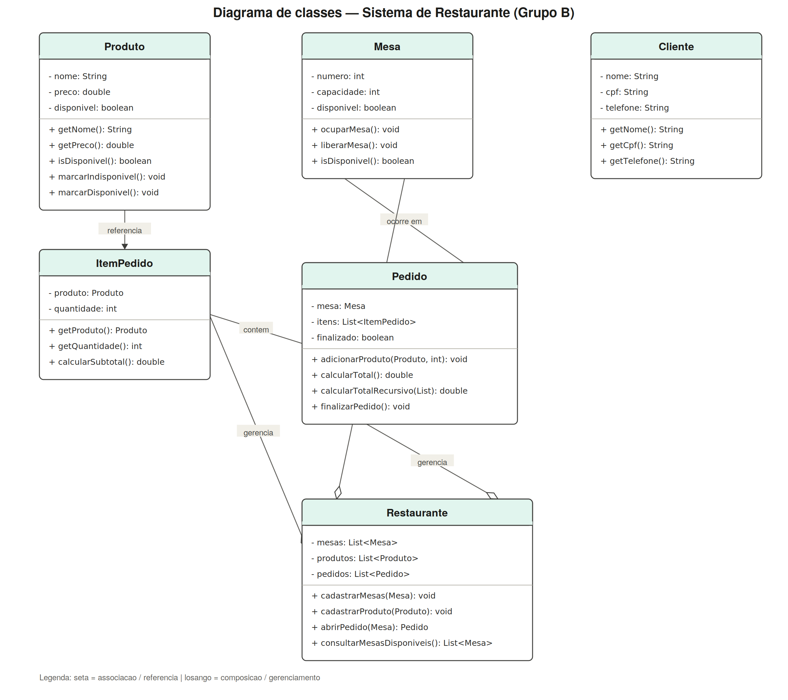

# Sistema de Gerenciamento de Restaurante

Trabalho de LP1 — **Grupo B**.

Sistema em Java que simula as operações básicas de um restaurante: cadastro de mesas e produtos, abertura de pedidos, adição de itens, cálculo do total e finalização do atendimento.

## Objetivo

Aplicar, na prática, os conceitos de Programação Orientada a Objetos estudados na disciplina: classes e objetos, atributos e métodos, encapsulamento, construtores, relacionamento entre objetos, depuração e recursividade.

## Funcionalidades

- Cadastro de mesas (número e capacidade)
- Cadastro de produtos do cardápio (nome, preço e disponibilidade)
- Abertura de pedido vinculado a uma mesa disponível
- Adição de produtos (com quantidade) a um pedido
- Cálculo do valor total do pedido — versão iterativa e versão recursiva
- Finalização do pedido, liberando a mesa
- Consulta das mesas disponíveis no momento

## Estrutura das classes

| Classe | Responsabilidade |
|---|---|
| `Produto` | Representa um item do cardápio (nome, preço, disponibilidade) |
| `Mesa` | Representa uma mesa física (número, capacidade, disponibilidade) |
| `Cliente` | Representa o cliente atendido (nome, CPF, telefone) |
| `ItemPedido` | Representa um produto pedido, com sua quantidade |
| `Pedido` | Reúne os itens pedidos em uma mesa e concentra as regras de negócio |
| `Restaurante` | Gerencia as listas de mesas, produtos e pedidos do sistema |

## Regras de negócio implementadas

- Uma mesa não pode ter dois pedidos ativos simultaneamente
- Não é permitida a inclusão de produto indisponível em um pedido
- Um pedido precisa ter pelo menos um item para ser finalizado
- O valor total é calculado a partir dos produtos e suas quantidades
- Ao finalizar um pedido, a mesa correspondente volta a ficar disponível

## Diagrama de classes



## Como executar

1. Compile todas as classes:
   ```
   javac *.java
   ```
2. Execute a classe principal:
   ```
   java Main
   ```

## Exemplo de uso (Main.java)

```java
Restaurante restaurante = new Restaurante();

Mesa mesa1 = new Mesa(1, 4);
restaurante.cadastrarMesas(mesa1);

Produto produto1 = new Produto("Produto Genérico", 20.0);
restaurante.cadastrarProduto(produto1);

Pedido pedido1 = restaurante.abrirPedido(mesa1);
pedido1.adicionarProduto(produto1, 5);

System.out.println(pedido1.calcularTotal()); // 100.0

pedido1.finalizarPedido();
```

## Integrantes — Grupo B

- [Marlon Santos carvalho]
- [João Vitor Gonçalves de Jesus]
- [Marco Antônio Chaves De Souza]
- [Gabriel]

## Dificuldades encontradas

[Durante o desenvolvimento, o grupo enfrentou algumas dificuldades típicas de quem está começando com Programação Orientada a Objetos em Java:

- Entender a diferença entre `this.atributo` e o parâmetro do construtor — no início, a atribuição foi feita de forma invertida (`atributo = this.atributo`), o que fazia os objetos serem criados sem os dados corretos.
- Compreender que um método getter não deve receber parâmetro, já que ele apenas devolve um valor que o próprio objeto já armazena internamente.
- Lembrar de inicializar listas (`List`) com `new ArrayList<>()` antes de usá-las, evitando erros de execução por referência nula.
- Perceber que inicializar a lista de itens dentro do método errado (em vez do construtor) fazia com que os itens já adicionados fossem perdidos a cada nova chamada.
- Diferenciar o uso de `=` e `+=` ao acumular valores dentro de um laço de repetição, especialmente no cálculo do total do pedido.
- Lidar com conflitos de nome entre atributos e parâmetros de mesmo nome dentro de um método.
- Compreender e implementar a recursividade no cálculo do total do pedido, definindo corretamente o caso base (lista vazia) e o caso recursivo (soma do primeiro item com o restante da lista).
- Trabalhar pela primeira vez com listas genéricas de objetos (`List<ItemPedido>`), em vez de apenas tipos simples como `String` ou `int`.

Essas dificuldades foram resolvidas por meio de revisão de código, testes e uso do depurador (debug) da IDE para acompanhar o comportamento do programa passo a passo.]
